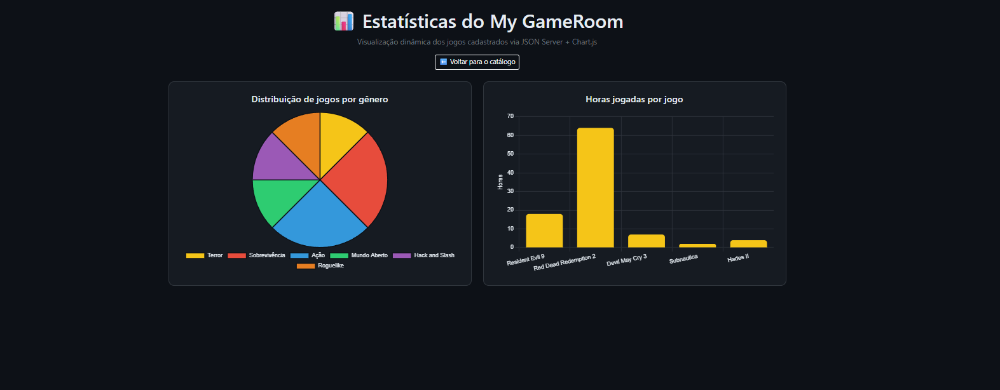
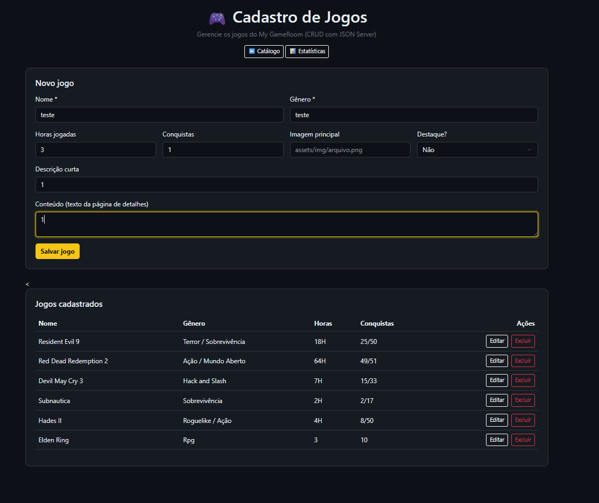
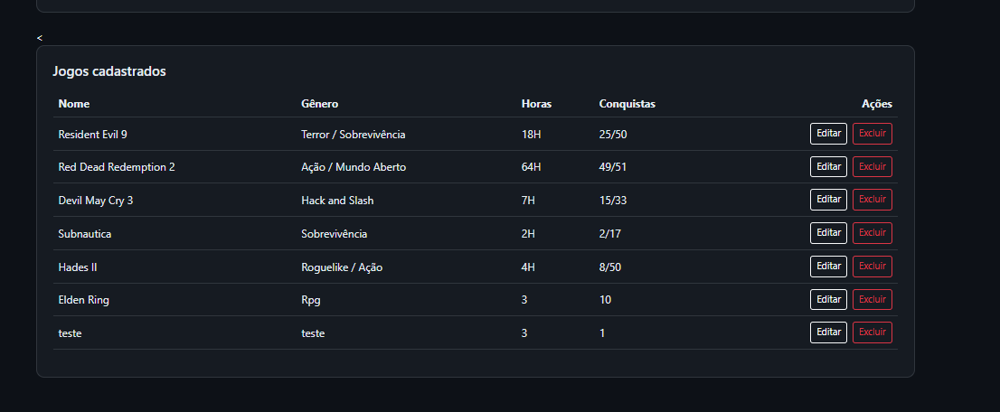

# Trabalho Prático - Semana 14

A partir dos dados que você tem no seu projeto, vamos trabalhar formas de apresentação que representem de forma clara e interativa essas informações. Você poderá usar gráficos (barra, linha, pizza), mapas, calendários ou outras formas de visualização. Seu desafio é entregar uma página Web que organize, processe e exiba os dados de forma compreensível e esteticamente agradável.

Com base nos tipos de projetos escohidos, você deve propor **visualizações que estimulem a interpretação, agrupamento e exibição criativa dos dados**, trabalhando tanto a lógica quanto o design da aplicação.

Sugerimos o uso das seguintes ferramentas acessíveis: [FullCalendar](https://fullcalendar.io/), [Chart.js](https://www.chartjs.org/), [Mapbox](https://docs.mapbox.com/api/), para citar algumas.

## Informações do trabalho

- Nome: Kaique Rodrigues
- Matricula: 913328
- Proposta de projeto escolhida: My GameRoom — catálogo de jogos
- Breve descrição sobre seu projeto: O My GameRoom é uma aplicação web para catalogar e explorar jogos, funcionando como uma "sala de jogos" pessoal. Os dados dos jogos (nome, gênero, horas jogadas, conquistas e imagens) são servidos por um backend simulado com JSON Server e consumidos de forma assíncrona via Fetch API, com renderização dinâmica dos cards e páginas de detalhe no DOM.

**Print da tela com a implementação**
Nesta etapa foi implementada a página `graficos.html`, que apresenta os dados dos jogos de forma dinâmica utilizando a biblioteca **Chart.js**. A página realiza uma requisição assíncrona com Fetch API ao endpoint `/jogos` do JSON Server e processa os dados em JavaScript para montar duas visualizações: um **gráfico de pizza** com a distribuição de jogos por gênero (os gêneros compostos, como "Roguelike / Ação", são separados e contabilizados individualmente) e um **gráfico de barras** com as horas jogadas em cada jogo (convertendo valores como "64H" em números). Também foi incluída a página `cadastro.html`, com o CRUD completo de jogos (cadastro, edição e exclusão via Fetch API). Os gráficos refletem automaticamente as alterações feitas nos dados por meio do CRUD, como mostram os prints abaixo — o segundo foi tirado após o cadastro de um novo jogo.

